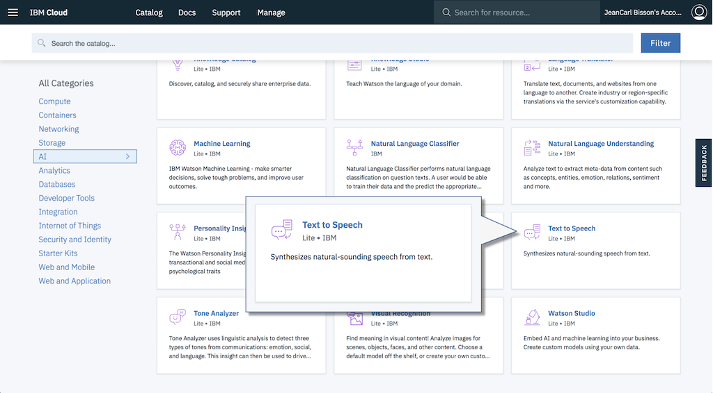
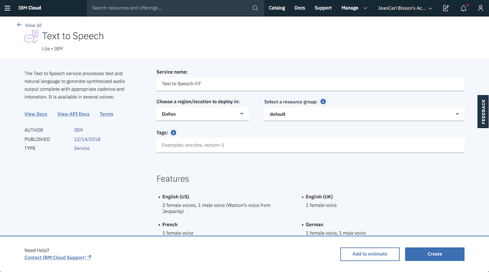
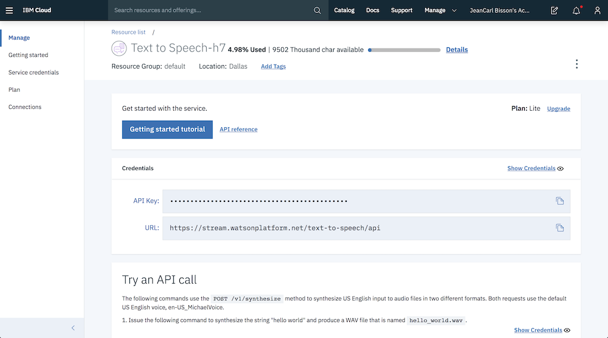
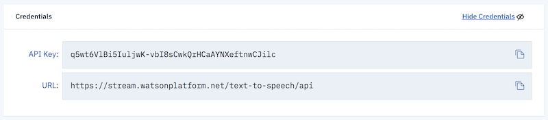

# Text to Speech

TJBot can speak using the speaker and with the help of the [Watson Text to Speech Service](https://ibm.biz/catalog-text-to-speech).

## Create a Watson Text to Speech service

1. [Sign up](https://ibm.biz/tjbot-challenge-signup) for an IBM Cloud account. If you already have an IBM Cloud account, sign in.

2. Click on the __Catalog__ link in the top right corner of the IBM Cloud dashboard.

	

3. Select the __Text to Speech__ service tile under the __AI__ section of the catalog.

	

4. Click on __Create__ to create a service instance.

	

5. Click __Show Credentials__.

	

6. Copy the API Key credential credentials into the `.env` file in the simulator.

	

```
TEXT_TO_SPEECH_API_KEY=
```

## Command TJBot to Speak

For each step, REPLACE the placeholders `/* step ## */` with the suggested code. Do not keep any part of these placeholders in the final code!

1. First, we create a TJBot object. Here's a template to start with. Copy the template into the `app.js` file in the simulator.

	```
	var tj = new TJBot(
	  [/* step #2 */],
	  {
	    robot: {
	      gender: "/* step #3 */"
	    },
	    speak: {
	      language: "/* step #4 */"
	    }
	  },
	  {
	    /* step #5 */
	  }
	);

	/* step #6 */
	```

2. Enable TJBot to use the speaker hardware by adding the string `"speaker"` as an array element.

	```
	var tj = new TJBot(
	  ["speaker"],
	  {
	    robot: {
	...
	```

3. Give the TJBot a gender, `male` or `female`. This will determine the gender of the voice used to synthesize the text.

	```
	...
 	    robot: {
	      gender: "female"
  	    },
	...
	```	    

4. Configure the language TJBot should speak. In this challenge, use `en-US`

	```
	    speak: {
	      language: "en-US"
	    }
	```

5. Configure the Watson Text to Speech credentials TJBot should use to speak. Earlier we stored them into an environment variable.

	```
	  text_to_speech: {
	    apikey: process.env.TEXT_TO_SPEECH_API_KEY
	  }
	```

6. We now have a TJBot configured to speak. Call the `speak` method and have it say `Hello`.

	```
	tj.speak("Hello");
	```

7. Run the code by clicking on the play icon. Did TJBot say hello? You've completed this challenge.
