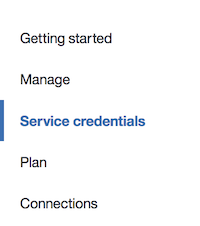
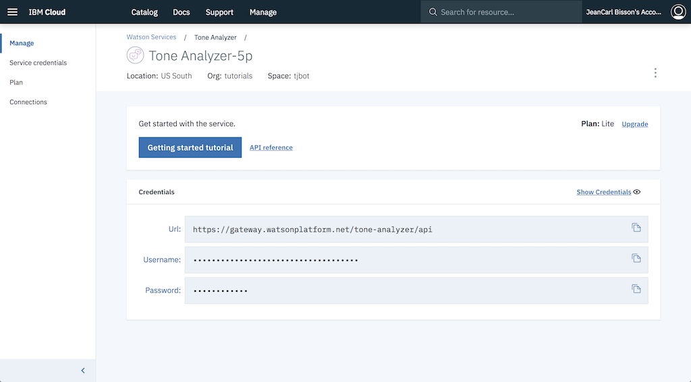

# Tone Analyzer

TJBot can analyze the emotion of text with the help of the [Watson Tone Analyzer Service](https://ibm.biz/catalog-tone-analyzer).

## Create a Watson Tone Analyzer service

1. Sign up for an IBM Cloud account at [bluemix.net](https://bluemix.net). If you already have an IBM Cloud account, sign in.

2. Click on the __Catalog__ link in the top right corner of the IBM Cloud dashboard.

3. Select the __Language Translator__ service tile under the __Watson__ section of the catalog.

	

4. Click on __Create__ to create a service instance.
5. Select __Service Credentials__ in the left sidebar.

	

6. Click on __View Credentials__ to display the credentials (note: if no credentials are listed, click on __New credential__ to create a new set). Copy the username and password credentials into the `.env` file in the simulator.

	

```
TONE_ANALYZER_USERNAME=
TONE_ANALYZER_PASSWORD=
```

## Command TJBot to Analyze Emotion

For each step, REPLACE the placeholders `/* step ## */` with the suggested code. Do not keep any part of these placeholders in the final code!

1. First, we create a TJBot object. Here's a template to start with. Copy the template into the `app.js` file in the simulator.

	```
	var tj = new TJBot(
	  [/* step #2 */],
	  {},
	  {
	    /* step #3 */
	  }
	);

	/* step #4 */
	```

2. Enable TJBot to use the LED hardware by adding the string `"led"` as an array element.

	```
	var tj = new TJBot(
	  ["led"],
	  {},
	```

3. Configure the Watson Tone Analyzer credentials TJBot should use to analyze the tone. Earlier we stored them into an environment variable.

	```
	  tone_analyzer: {
	    username: process.env.TONE_ANALYZER_USERNAME,
	    password: process.env.TONE_ANALYZER_PASSWORD
	  }
	```

4. We now have a TJBot configured to analyze the tone of content. Call the `analyzeTone` method with the content to analyze, `This is awesome!`. When TJBot analyzes the tones, a callback function will be passed the confidence scores. This code looks for the `emotion_tone` results and the tone with the highest scoring confidence. This emotion is then mapped to a color which the TJBot is instructed to shine it's light.

	```
	var text = "This is awesome!";
	var colors = {"anger":"red","joy":"yellow","fear":"magenta","disgust":"green","sadness":"blue"};

	tj.analyzeTone(text).then(response => {
      response.document_tone.tone_categories.forEach(function(category) {
	    if (category.category_id == "emotion_tone") {
	      // find the emotion with the highest confidence
	      var max = category.tones.reduce((a, b) => {
	        return (a.score > b.score) ? a : b;
	      });

	      // make sure we really are confident
	      if (max.score >= 0.5) {
	        console.log("Current emotion around is " + max.tone_id);
	        tj.shine(colors[max.tone_id]);
	      }
	    }
	  });
	});	
	```

5. Run the code by clicking on the play icon. Did TJBot analyze the emotion and shine it's light yellow? You've completed this challenge.
