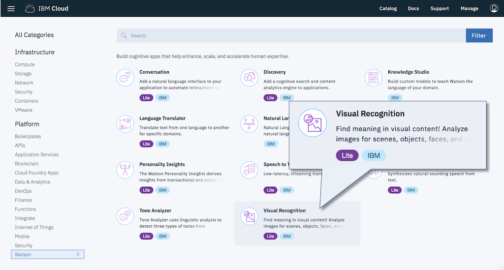
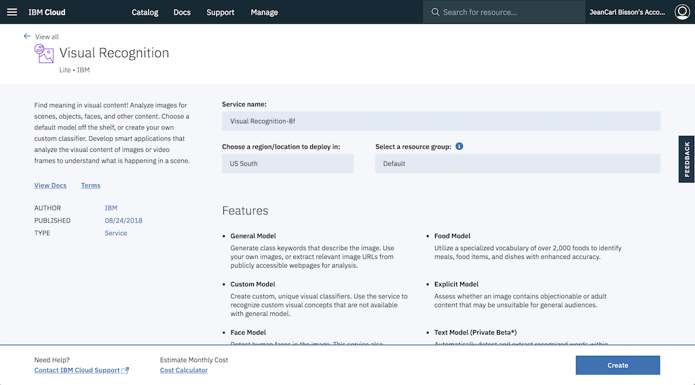
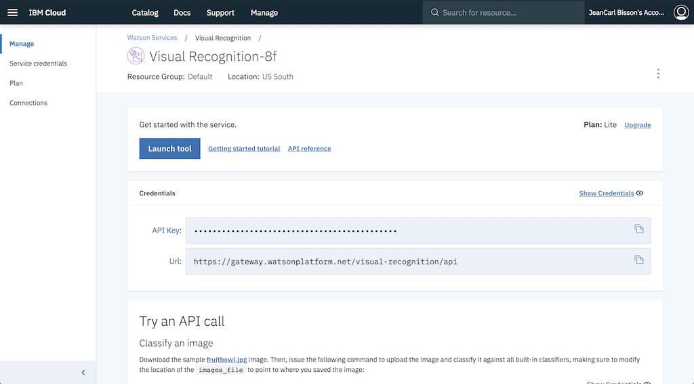
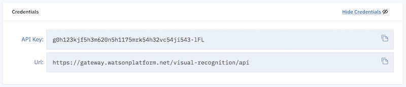

# Visual Recognition

TJBot can recognize objects and colors in an image with the help of the [Watson Visual Recognition Service](https://ibm.biz/catalog-visual-recognition).

## Create a Watson Visual Recognition service

1. [Sign up](https://ibm.biz/tjbot-challenge-signup) for an IBM Cloud account. If you already have an IBM Cloud account, sign in.

2. Click on the __Catalog__ link in the top right corner of the IBM Cloud dashboard.

	

3. Select the __Visual Recognition__ service tile under the __AI__ section of the catalog.

	

4. Click on __Create__ to create a service instance.

	

5. Click __Show Credentials__.

	

6. Copy the api_key credential into the `.env` file in the simulator.

	

```
VISUAL_RECOGNITION_API_KEY=
```

## Command TJBot to Translate Content

For each step, REPLACE the placeholders `/* step ## */` with the suggested code. Do not keep any part of these placeholders in the final code!

1. First, we create a TJBot object. Here's a template to start with. Copy the template into the `app.js` file in the simulator.

	```
	var tj = new TJBot(
	  [/* step #2 */],
	  {},
	  {
	    /* step #3 */
	  }
	);

	/* step #4 */
	```

2. Enable TJBot to use the camera hardware by adding the string `"camera"` as an array element.

	```
	var tj = new TJBot(
	  ["camera"],
	  {},
	```

3. Configure the Watson Visual Recognition credentials TJBot should use to classify the image. Earlier we stored them into an environment variable.

	```
	  visual_recognition: {
	    apikey: process.env.VISUAL_RECOGNITION_API_KEY
	  }
	```

4. We now have a TJBot configured to recognize objects. Call the `see` method. This will use the webcam, capture a picture, and classify it with the Watson Visual Recogntion service. A callback function will be passed an array of objects and confidence scores.

	```
	tj.see(objects => {
	  console.log(objects);
	});
	```

5. Run the code by clicking on the play icon. Did TJBot recognize objects and colors, and output the results into the console? You've completed this challenge.
